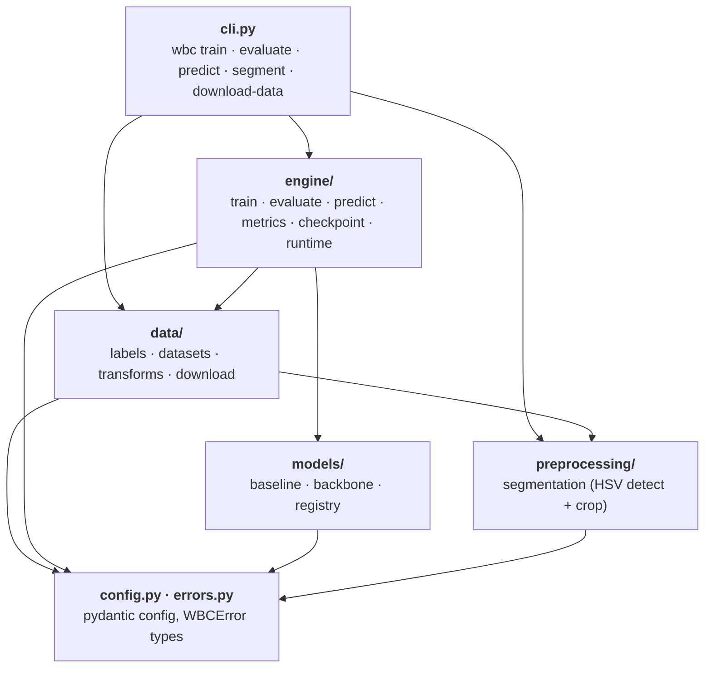

# Architecture

The package is organised in layers. Each layer only imports from the layers below it, which keeps
every module small, testable on its own and easy to replace.



## Layers

| Layer | Modules | Responsibility |
|---|---|---|
| Interface | `cli.py` | Parse arguments, build a `Config`, call the engine, print results. Turns any `WBCError` into `Error: …` and exit code 1. |
| Engine | `engine/train.py`, `evaluate.py`, `predict.py` | The three workflows. Orchestrate data and models; own the training loop, device handling and run folders. |
| Engine support | `engine/metrics.py`, `checkpoint.py`, `runtime.py` | Metrics and plots, single-file checkpoints, seeding and device selection. |
| Data | `data/labels.py`, `datasets.py`, `transforms.py`, `download.py` | Find classes from folders, list samples, stratified split, load images as RGB, build transforms and `DataLoader`s, fetch the Kaggle dataset. |
| Models | `models/baseline.py`, `backbone.py`, `registry.py` | The networks and a name → factory registry. See [Models](models.md). |
| Preprocessing | `preprocessing/segmentation.py` | Classical OpenCV cell detection and crop. Optional. See [Pipeline](pipeline.md). |
| Foundation | `config.py`, `errors.py` | Validated configuration and the shared error types. No dependencies on other layers. |

## Design rules

- **One direction.** Lower layers never import upper layers. Nothing runs at import time.
- **Config in, artifacts out.** Every workflow takes a validated `Config` (YAML + CLI overrides) and writes
  to a run folder; the saved `config.yaml` reproduces the run.
- **One checkpoint file.** A `.pt` file holds the weights, the class names and the full config, so
  `evaluate` and `predict` need nothing but the file. The model is rebuilt from the stored config.
- **Errors at the boundaries.** Config loading, dataset discovery, image loading and checkpoint loading
  validate their input and raise `ConfigError`, `DataError`, `SegmentationError` or `CheckpointError` with an
  actionable message. Inner code trusts validated inputs.
- **Extensible by registry.** A new model is one entry in `models/registry.py`, a config in `configs/` and a
  shape test.

## Repository layout

```
src/wbc_classification/
├── config.py          # pydantic config + YAML loading + overrides
├── errors.py          # WBCError and subclasses
├── data/              # labels, datasets/loaders, transforms, Kaggle download
├── preprocessing/     # optional HSV cell segmentation and crop
├── models/            # baseline (IncludeNet), torchvision backbones, registry
├── engine/            # train, evaluate, predict, metrics, checkpoints, runtime
└── cli.py             # `wbc` Typer application
configs/               # one YAML per experiment
tests/                 # unit, CLI and end-to-end smoke tests (fixture dataset)
docs/                  # this site
```

See the generated [Python API](reference/api.md) for signatures.
