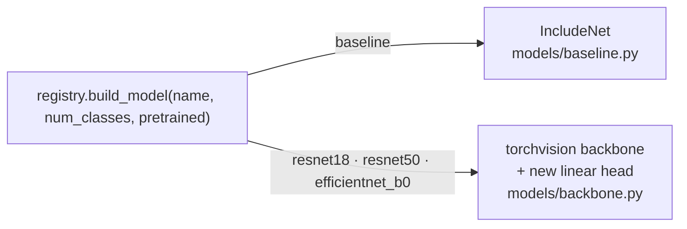
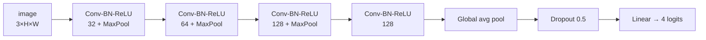

# Models

Models are built by name through one function, `build_model(name, num_classes, pretrained)` in
`models/registry.py`. Every model takes a batch of RGB images `(N, 3, H, W)` and returns raw class scores
(logits) `(N, num_classes)`; the loss applies softmax internally and `predict` applies it explicitly.

| Name | Type | Parameters (4 classes) | Typical input | Pretrained weights |
|---|---|---|---|---|
| `baseline` | small custom CNN (IncludeNet) | 241,700 | 64 × 64 | no |
| `resnet18` | ResNet-18 | 11,178,564 | 128 × 128 | ImageNet |
| `resnet50` | ResNet-50 | 23,516,228 | 128 × 128 or larger | ImageNet |
| `efficientnet_b0` | EfficientNet-B0 | 4,012,672 | 160 × 160 | ImageNet |

The "typical input" is what the shipped configs use (there is no shipped `resnet50` config; copy
`configs/resnet18.yaml` and change `model.name`). Any size ≥ 16 px works because every model ends in
global average pooling. Parameter counts are for the 4-class head.

## `baseline`: IncludeNet layer by layer

The original project's small CNN, rewritten in PyTorch with BatchNorm and global average pooling (the
legacy Keras version used a fixed-size flatten and no normalisation). Shapes below are for a 64 × 64 input.

| # | Layer | Output shape | Parameters |
|---|---|---|---|
| – | Input (RGB, normalised) | 3 × 64 × 64 | – |
| 1 | Conv 3×3, 3 → 32, pad 1, no bias · BatchNorm · ReLU · MaxPool 2 | 32 × 32 × 32 | 928 |
| 2 | Conv 3×3, 32 → 64 · BatchNorm · ReLU · MaxPool 2 | 64 × 16 × 16 | 18,560 |
| 3 | Conv 3×3, 64 → 128 · BatchNorm · ReLU · MaxPool 2 | 128 × 8 × 8 | 73,984 |
| 4 | Conv 3×3, 128 → 128 · BatchNorm · ReLU | 128 × 8 × 8 | 147,712 |
| 5 | Global average pooling | 128 | – |
| 6 | Dropout (p = 0.5) | 128 | – |
| 7 | Linear 128 → 4 | 4 | 516 |

The width (32) and dropout (0.5) are constructor arguments of `IncludeNet`; the registry uses the defaults.

## Backbones

`build_backbone` loads a torchvision model (`weights="DEFAULT"` = ImageNet when `model.pretrained: true`)
and replaces only the final classification layer with a fresh `Linear(…, num_classes)`. Everything else is
the stock architecture.

| Model | Feature extractor (unchanged) | Head that is replaced |
|---|---|---|
| `resnet18` | 7×7 stride-2 conv stem → max-pool → 4 stages of 2 BasicBlocks (64, 128, 256, 512 ch) → global avg pool | `fc`: Linear 512 → 4 |
| `resnet50` | same stem → 4 stages of 3, 4, 6, 3 Bottleneck blocks (256, 512, 1024, 2048 ch) → global avg pool | `fc`: Linear 2048 → 4 |
| `efficientnet_b0` | 3×3 stride-2 stem → 7 MBConv stages → 1×1 conv to 1280 ch (SiLU, BatchNorm) → global avg pool | `classifier[-1]`: Linear 1280 → 4 (the preceding Dropout 0.2 is kept) |

### Freezing the backbone

With `model.freeze_backbone_epochs: N`, only the new head is trained for the first N epochs, then all
layers are unfrozen and fine-tuned together. This protects the pretrained features while the random head
settles. Notes:

- Only backbones support it; `baseline` raises a `ConfigError` if you set it.
- Frozen layers keep `requires_grad = False`, but BatchNorm layers inside the frozen backbone still update
  their running statistics because the model stays in train mode.
- Early-stopping patience also counts the frozen epochs.

## Choosing a model

- **No GPU, quick experiments, or a lightweight baseline:** `baseline`.
- **Best accuracy for the effort:** `resnet18` or `efficientnet_b0` fine-tuned from ImageNet weights.
- **Larger capacity:** `resnet50`, at roughly twice the compute of `resnet18`.

No accuracy numbers are published yet; see [Results](results.md) for how to produce them.

## Adding a model

1. Implement it (or wrap a torchvision model) in `models/` so it maps `(N, 3, H, W)` to `(N, num_classes)`.
2. Add it to `MODEL_NAMES` and `build_model` in `models/registry.py`.
3. Add a YAML in `configs/` and a shape test in `tests/test_models.py`.

If it is a backbone with a replaceable head, also teach `set_backbone_frozen` which attribute is the head.
