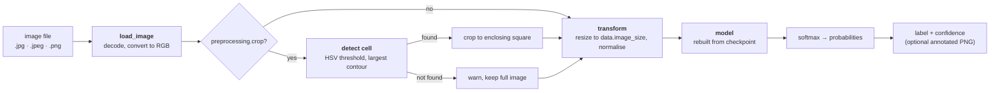
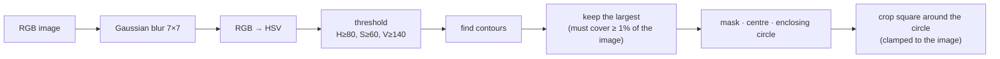
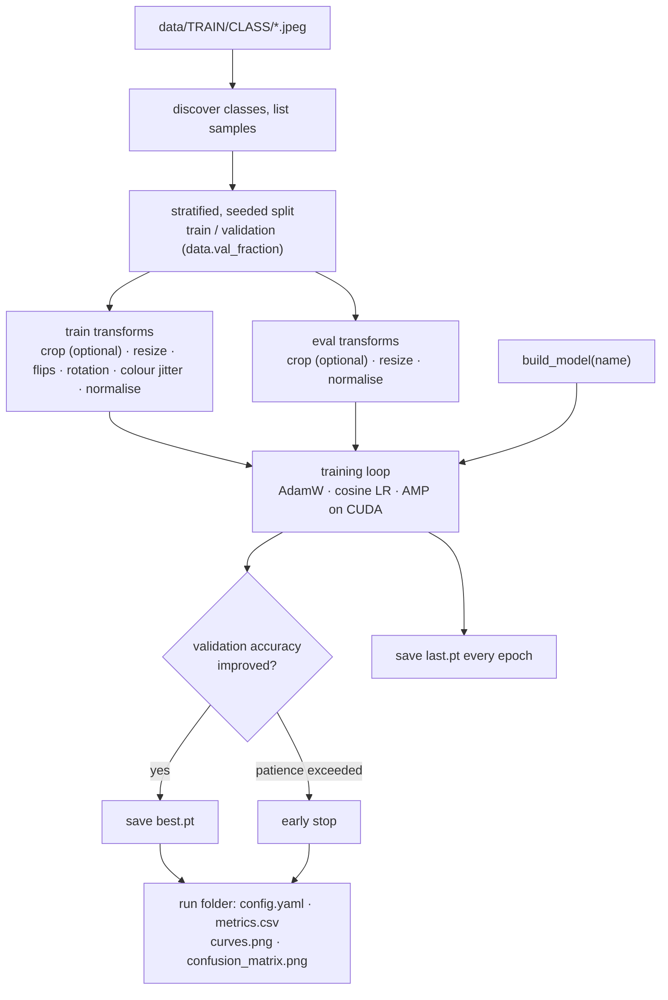

# Pipeline: detection and classification, end to end

This page follows one image from a file on disk to a predicted cell type, and the same stages during
training and evaluation. Every stage is a small module with a matching config key.

!!! note "Scope: one cell per image"
    The pipeline classifies **one white blood cell per image**, like the Kaggle dataset it is trained on.
    The optional detection step finds the single largest cell-coloured region. It does **not** detect or
    count several cells in a wide smear image, and no cell counting is implemented. See
    [Limits](#limits-and-what-is-not-included).

## Inference (`wbc predict`)

1. **Load** (`data/datasets.py: load_image`): decode the file and convert it to RGB. Grayscale, RGBA and
   palette images work; an unreadable file raises `DataError` naming the file.
2. **Detect and crop** (`preprocessing/segmentation.py`), only when `preprocessing.crop: true` in the checkpoint's
   config: see [Detection stage](#detection-stage). If no cell is found the full image is used and a
   warning is logged, so one bad image never stops a batch.
3. **Transform** (`data/transforms.py`): resize to the square `data.image_size`, convert to a float tensor in
   [0, 1] and normalise with the ImageNet mean/std. (The same transform is used for evaluation.)
4. **Model** (`models/`): rebuilt from the architecture name and class names stored in the checkpoint, set to
   eval mode, run without gradients on the chosen device.
5. **Output**: softmax gives one probability per class; the highest is the predicted label. `wbc predict` prints
   `path: LABEL (confidence)` per image and can save labelled copies with `--annotate-dir`.

The crop setting and image size come from the checkpoint, so inference always matches how the model was trained.

## Detection stage

`wbc segment` and the optional crop use classical computer vision, no learned weights:

- The thresholds were tuned for the stained images in this dataset. On other stains, scanners or magnifications
  they may need adjusting (`HSV_LOWER` / `HSV_UPPER` in `preprocessing/segmentation.py`); check with
  `wbc segment` before enabling `preprocessing.crop`.
- Only the **largest** region is kept. If nothing passes the threshold, or the region is smaller than 1% of
  the image, a `SegmentationError` is raised (`wbc segment` reports it; training and prediction fall back to the
  full image).
- `wbc segment image.jpeg --output-dir out/` writes `*_crop.png`, `*_overlay.png` (contour and circle drawn)
  and `*_mask.png` so you can inspect what the detector did. The step-by-step images are in the
  [detection walkthrough](wbc-detection.md).

## Training (`wbc train`)

- **Split:** the validation set is carved from `TRAIN` with a seeded, stratified split; `TEST` is never used
  during training.
- **Augmentation** (training only): random horizontal and vertical flips, rotation up to 180°, and mild colour
  jitter to cover stain variation. Cells have no preferred orientation, so these are label-preserving.
- **Reproducibility:** the seed fixes Python, NumPy and PyTorch randomness, and the run folder keeps the exact
  config.
- **Output:** `runs/<name>-<timestamp>/` with `config.yaml`, `metrics.csv`, `curves.png`,
  `confusion_matrix.png` (validation, best epoch), `best.pt` and `last.pt`.

## Evaluation (`wbc evaluate`)

`evaluate` loads a checkpoint and runs it over `TEST/` with the eval transform (and the crop setting stored in
the checkpoint). It reports per-class precision, recall and F1 plus accuracy and a confusion matrix, and with
`--output` writes them as JSON and a PNG. This is the number to report: the validation split comes from the
training folder, which in the Kaggle dataset contains augmented copies of the same originals (see
[Data](data.md)).

## From stage to code

| Stage | Config key | Code |
|---|---|---|
| Find classes and samples | `data.root` | `data/labels.py`, `data/datasets.py` |
| Split | `data.val_fraction`, `train.seed` | `data/datasets.py: stratified_split` |
| Detect and crop | `preprocessing.crop` | `preprocessing/segmentation.py` |
| Resize, augment, normalise | `data.image_size` | `data/transforms.py` |
| Model | `model.name`, `model.pretrained` | `models/registry.py` |
| Optimise | `train.lr`, `train.epochs`, `train.patience` | `engine/train.py` |
| Metrics | – | `engine/metrics.py` |
| Save and reload | – | `engine/checkpoint.py` |

## Limits and what is not included

- **One cell per image.** Detection keeps only the largest region. A smear image with many white cells would be
  classified as if it contained one.
- **No counting.** There is no multi-cell detection, no per-cell classification across an image and no cell
  counts. These would need a different detector (for example connected components or a learned object
  detector) feeding each cell crop to the classifier; none of that exists in this project.
- **Four classes.** Eosinophil, lymphocyte, monocyte, neutrophil only; other cell types and non-cell images are
  not recognised, and the model always picks one of the four.
- **Research use only.** This is an educational/research project, not a validated medical device.
