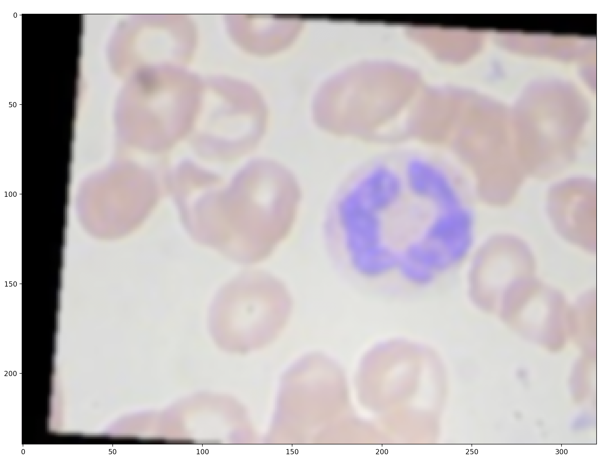
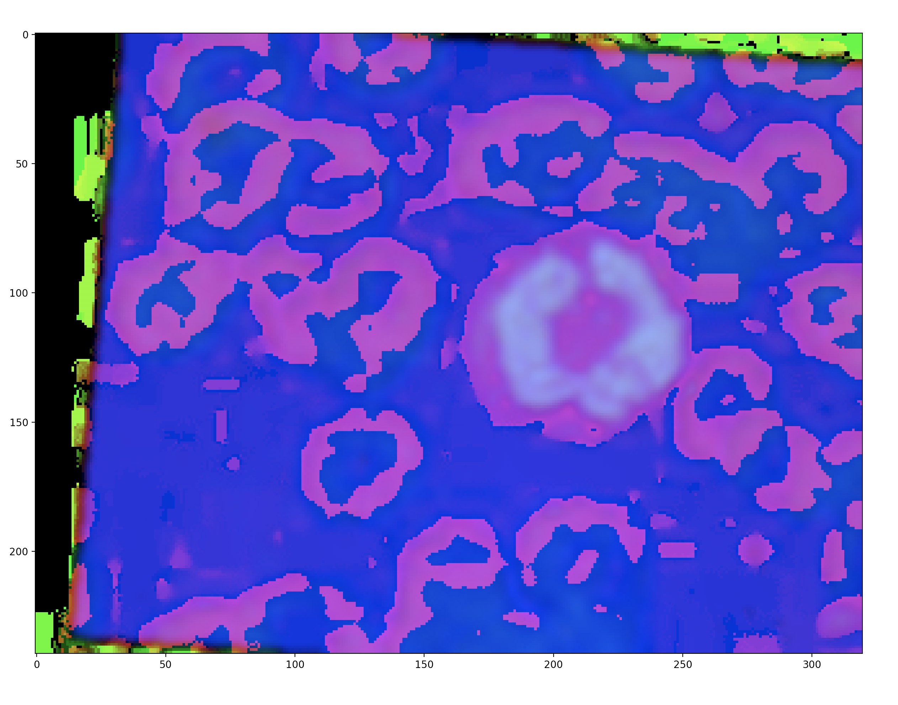
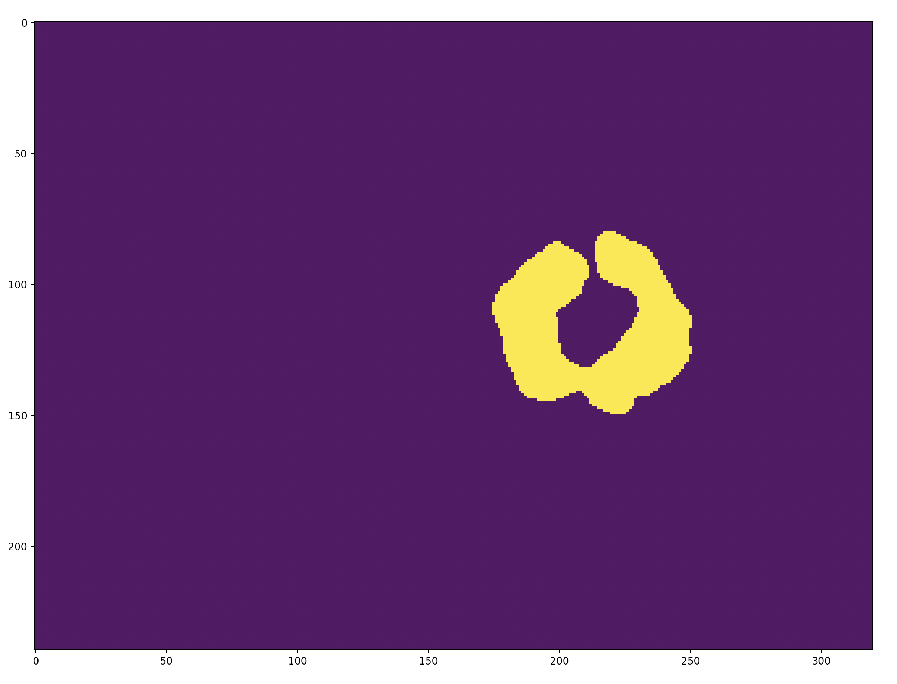
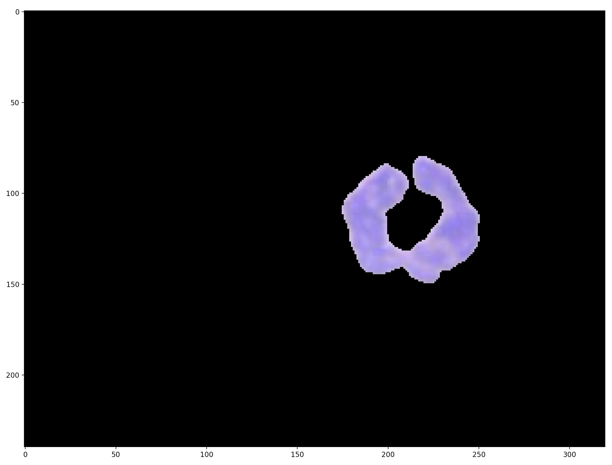
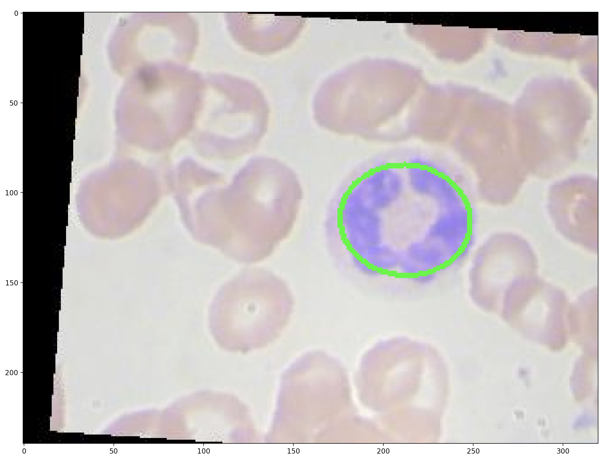

# WBC detection walkthrough

The optional crop step locates the white blood cell with classical computer vision:

1. Blur the RGB image (Gaussian, 7×7) — 
2. Convert to HSV — 
3. Keep pixels inside the cell colour range (H 80–255, S 60–255, V 140–255) — 
4. Take the largest contour as the cell mask — 
5. Crop around the minimum enclosing circle — 

Try it on your own image:

```bash
poetry run wbc segment path/to/cell.jpeg --output-dir segmentation
```

or use the code directly: `wbc_classification.preprocessing.segmentation.segment_cell`.
